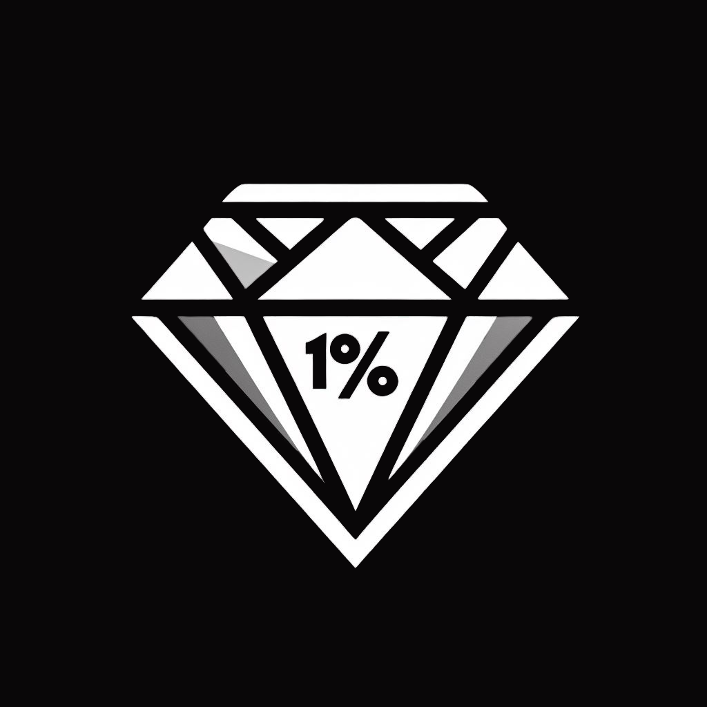

# T.O.P App - G4
**Systematize your improvement**

---

## :information_source: Información del Proyecto

**T.O.P App** es una aplicación creada para ayudar a los usuarios a mejorar constantemente sus hábitos y lograr sus objetivos mediante retos personalizados, registro de progreso y comunidad.

Para obtener información detallada sobre la idea del proyecto, su historia, visión y funcionalidades principales, por favor visita la [Wiki del proyecto](https://github.com/puj-course/fis_2025_g4/wiki).

---

## :art: Diseños

Los diseños Hi-Fi están disponibles en la carpeta `design/designs/`, donde encontrarás:
- Capturas de pantalla del diseño de cada pantalla
- Un archivo *.fig* para abrir en Figma y explorar el flujo completo de la aplicación

---

## :gear: Requerimientos

Los requerimientos funcionales y no funcionales están documentados en el archivo `docs/requirements/Requisitos T.O.P.pdf`.

---

## :scroll: Documentación

La carpeta `docs/` contiene:
- **`docs/architecture/`**: Documentación de la arquitectura del proyecto.
- **`docs/api/`**: Documentación de los endpoints y estructura de la API.

---

## :file_folder: Código Fuente

El código fuente de la aplicación se encuentra en `src/top_app/` y sigue la estructura convencional de un proyecto Flutter.

---

## :iphone: Descripción de las Pantallas Principales

### :house: Home Screen
La pantalla principal donde el usuario puede ver sus actividades del día:
- Actividades pendientes y completadas se diferencian visualmente.
- Cada actividad puede ser:
  - Marcada como completada.
  - Iniciar un contador para registrar el tiempo.
  - Permitir subir una imagen como prueba.
  - Agregar una descripción del progreso.
- Si no hay actividades, se mostrará un mensaje sugiriendo explorar la página de retos.
- Además, se muestran las metas diarias como una lista de tareas (TODO list).

---

### :fire: Tribe Page
Una pantalla estilo "timeline" donde se pueden ver los resúmenes diarios de otros usuarios:
- Fotografías y textos subidos por los usuarios ese día.
- Actividades completadas y metas diarias alcanzadas.
- Estadísticas de porcentaje de cumplimiento y rachas actuales.
- Permite dar "like" y comentar en las publicaciones.

Cada publicación incluye:
- Foto de perfil del usuario.
- Nombre de usuario.
- Puntos Edge acumulados (equivalente a XP en juegos).

---

### :trophy: Challenges Page
En esta sección se pueden explorar los retos disponibles:
- Cada reto muestra:
  - Imagen en miniatura.
  - Título del reto.
  - Puntos Edge que se obtienen al completarlo.
  - Duración (días, semanas o meses).
- Se pueden aplicar filtros y búsquedas por:
  - Título.
  - Duración.
  - Puntos Edge.

---

### :dart: Challenge Detail Page
En esta pantalla se detallan los retos seleccionados:
- Imagen en miniatura.
- Duración.
- Puntos Edge a obtener.
- Nombre del creador.
- Actividades requeridas (ej. leer 30 minutos diarios, despertar a las 5 a.m.).
- Pruebas de completación necesarias (ej. subir una imagen, iniciar un temporizador).
- Lista de competidores que participan en el reto, con opción para ver más.
- Permite iniciar el reto directamente desde esta pantalla.

---

### :bust_in_silhouette: Profile Page
La página de perfil donde el usuario puede ver su propio perfil o el de otros:
- Nombre de usuario y foto de perfil.
- Puntos Edge acumulados.
- Retos en los que está registrado.
- Insignias ganadas (medallas por retos completados).
- Racha actual en retos activos y racha máxima en retos finalizados.
- Metas anuales y semanales, con barra de progreso.
- Lista de todas las publicaciones diarias (mismo diseño que en la página Tribe).

---

## :rocket: Equipo de Desarrollo
- Diseñador UI/UX: Alejandro Parrado
- Q/A Tester: Alejandro Parrado
- Desarrollador Frontend: Alejandro Parrado
- Desarrollador Backend: Alejandro Parrado
- Arquitecto de Sofware: Alejandro Parrado
- Especialista Cloud: Alejandro Parrado

