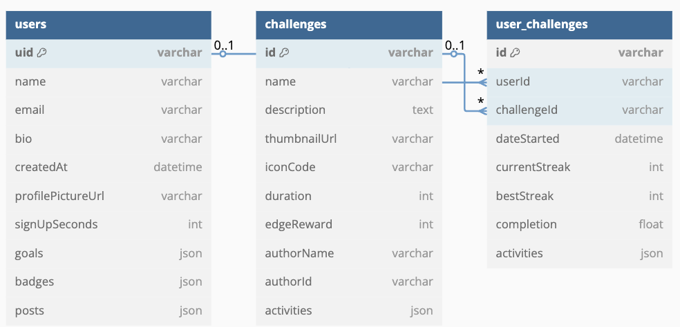

# Diagrama de Base de Datos

Este diagrama representa la estructura de datos en la base de datos utilizada por la aplicación, que está construida sobre **Firebase Firestore**, una base de datos NoSQL orientada a documentos.

## Estructura General

La base de datos se compone de dos colecciones principales:

### 1. `users`
Contiene un documento por cada usuario registrado. Cada documento incluye:
- Información personal (uid, nombre, email, etc.)
- Foto de perfil, bio, fecha de creación
- Una lista de `UserChallenge`, que representa los retos en los que participa el usuario, junto con su progreso
- Otras listas como metas (`goals`), insignias (`badges`) y publicaciones (`posts`)

### 2. `challenges`
Contiene los retos disponibles en la plataforma. Cada reto tiene:
- Nombre, descripción, duración y recompensas
- Información del autor
- Una lista de actividades (`activities`) que componen el reto

### 3. `UserChallenge` (estructura embebida en `users`)
- Referencia a un `challengeId`
- Datos personalizados como progreso, fecha de inicio, racha actual, mejor racha y porcentaje completado

## Justificación de diseño

- **Modelo embebido**: `UserChallenge` está embebido en `users` porque representa información específica y exclusiva del usuario. Esto mejora la lectura de datos personalizada y evita llamadas cruzadas costosas.
- **Modelo compartido**: `challenges` es una colección general compartida por todos los usuarios. Es independiente para facilitar su administración.

## Ventajas técnicas

- **Escalabilidad**: Firestore permite escalar horizontalmente y cargar solo los documentos necesarios.
- **Acceso rápido**: el diseño embebido permite obtener toda la información de un usuario en una sola lectura.
- **Flexibilidad**: el modelo NoSQL permite modificar la estructura sin migraciones complejas.

## Relación con el resto del sistema

- Las entidades `User`, `UserChallenge`, `Challenge`, `Activity` y `Proof` están sincronizadas con este modelo.
- La capa `data/` del proyecto contiene los modelos y data providers que interactúan directamente con Firestore basados en esta estructura.
