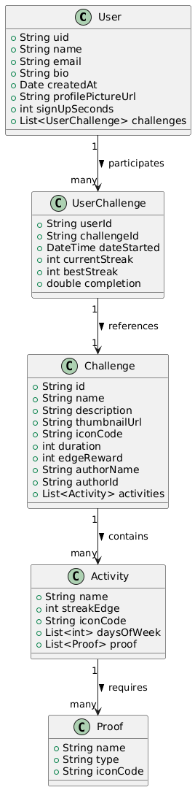

# Diagrama de Clases

Este diagrama representa las clases centrales del sistema utilizadas en esta entrega. Define las entidades principales, sus atributos y las relaciones entre ellas siguiendo principios de orientación a objetos.

## Clases incluidas

- **User**: representa al usuario registrado
- **UserChallenge**: representa el progreso de un usuario dentro de un reto
- **Challenge**: representa un reto con nombre, descripción, actividades, etc.
- **Activity**: representa una actividad que debe realizarse dentro de un reto
- **Proof**: representa la evidencia que debe proporcionar el usuario para completar una actividad

## Relaciones clave

- `User` tiene una lista de `UserChallenge`
- `UserChallenge` referencia un `Challenge` mediante `challengeId`
- `Challenge` contiene una lista de `Activity`
- `Activity` contiene una lista de `Proof`

## Justificación de diseño

- Se optó por separar `UserChallenge` de `Challenge` para desacoplar el progreso del usuario de la plantilla base del reto.
- Las clases siguen principios de SRP y composición, permitiendo escalar y reutilizar componentes.
- El modelo es fácil de mapear a estructuras Firestore y al mismo tiempo es claro para pruebas, validación y manipulación en memoria.

## Ventajas técnicas

- **Claridad**: cada clase tiene una responsabilidad clara y bien definida
- **Escalabilidad**: fácil de extender con nuevos atributos sin afectar otras clases
- **Mapeo directo**: el diseño permite serializar y deserializar de manera sencilla desde Firestore
