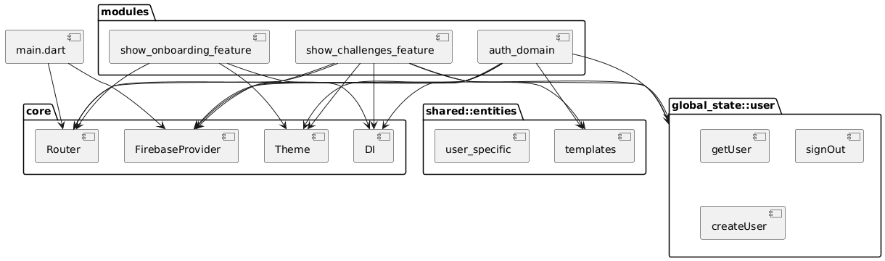

# Diagrama de Componentes

Este diagrama muestra la organización modular del sistema y las dependencias entre componentes del código. Representa la estructura real del proyecto y la forma en la que se separan las responsabilidades.

## Estructura principal del sistema

- **core/**: incluye funcionalidades generales como proveedores de servicios (Firebase), rutas de navegación, temas globales y configuración de dependencias.
- **modules/**: cada funcionalidad de la app tiene su propio módulo con arquitectura en capas (data, domain, presentation).
  - `auth_domain/`
  - `show_challenges_feature/`
  - `show_onboarding_feature/`
- **shared/**: contiene componentes reutilizables como widgets, cubits, entidades y modelos usados por varios módulos.
- **global_state/user/**: maneja el estado del usuario y provee funcionalidades globales como `getUser`, `signOut`, y `createUser`.

## Flujo de dependencias

- `modules/*` depende de `shared/` para entidades comunes
- `modules/*` y `global_state/` dependen de `core/providers` para acceder a Firebase
- `presentation/` de cada feature está desacoplada de `data/` mediante el uso de `domain/cubits` y `repositories` abstractas
- `UserPublicApi` en `global_state/user` actúa como fachada hacia `UserCubit`

## Justificación de diseño

- Cada módulo es autónomo y puede evolucionar sin afectar a otros
- La separación por carpetas ayuda a mantener bajo acoplamiento y alta cohesión
- Se siguen principios de Clean Architecture para mantener la escalabilidad y testabilidad

## Ventajas técnicas

- **Modularidad**: facilita el trabajo en equipo y el crecimiento del sistema
- **Reutilización**: componentes en `shared/` evitan la duplicación de código
- **Mantenibilidad**: cada componente tiene una dependencia bien definida y controlada
