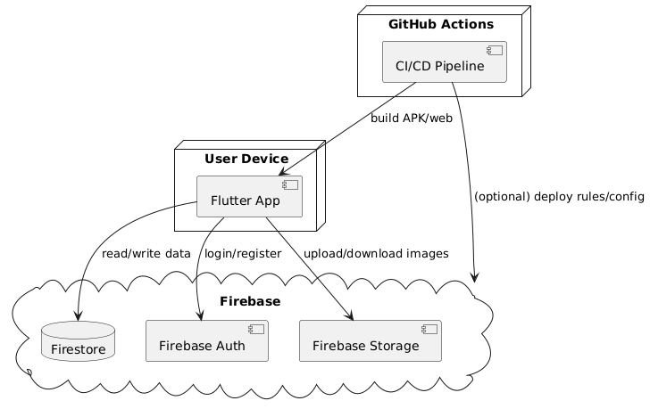

# Diagrama de Despliegue

El diagrama de despliegue muestra cómo se distribuyen los componentes del sistema en entornos de ejecución y cómo interactúan entre sí a nivel de infraestructura.

## Componentes del despliegue

- **Dispositivo del usuario**
  - Ejecuta la app Flutter
  - Interactúa con la interfaz gráfica construida con widgets

- **Firebase**
  - **Firestore**: base de datos en la nube (almacena usuarios, retos, progreso)
  - **Firebase Auth**: gestión de autenticación
  - **Firebase Storage**: almacenamiento de archivos como imágenes de perfil o evidencias

- **GitHub Actions** (CI/CD)
  - Workflow que construye el proyecto, genera APK y realiza validaciones automáticas
  - Artefactos de build disponibles para descarga

## Flujo general

1. El usuario descarga la app desde el build generado por GitHub Actions
2. Al iniciar sesión o registrarse, la app usa Firebase Auth
3. La app recupera datos del usuario y retos desde Firestore
4. Las evidencias o archivos multimedia se suben a Firebase Storage

## Justificación de diseño

- Firebase reduce complejidad al ofrecer un backend serverless, seguro y escalable
- GitHub Actions automatiza tareas repetitivas y mejora la calidad del código con validaciones en cada push

## Ventajas técnicas

- **Bajo costo de mantenimiento** al usar infraestructura en la nube
- **Seguridad y disponibilidad garantizada** por los servicios de Google Cloud
- **Automatización completa del ciclo de vida del producto** desde desarrollo hasta entrega

